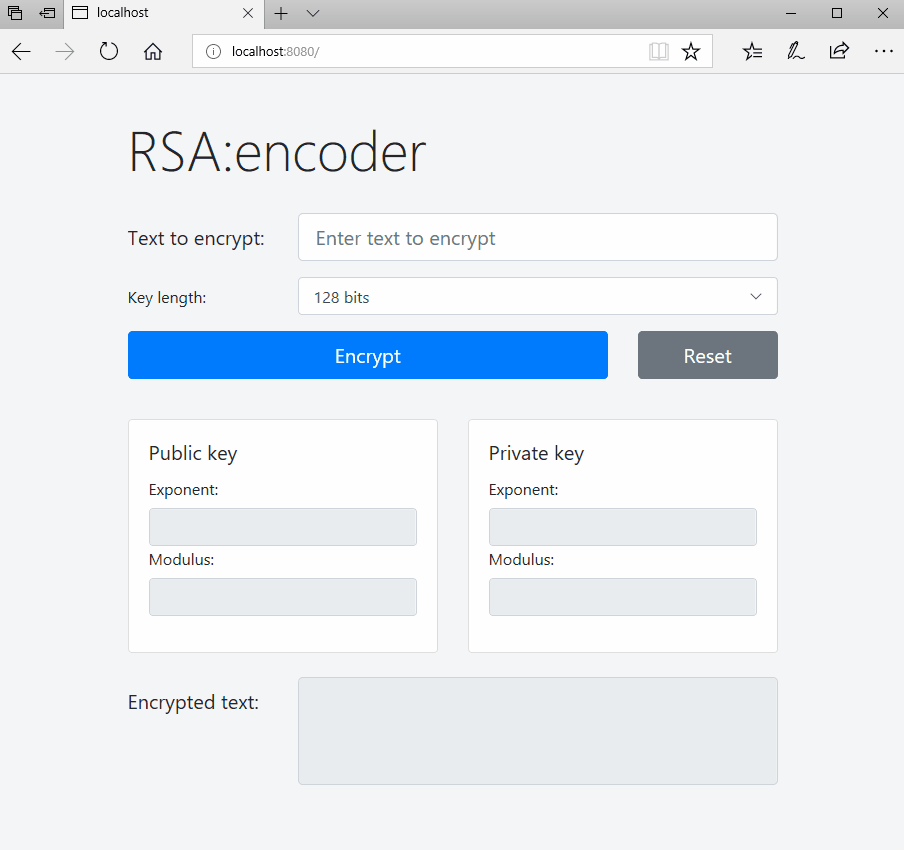
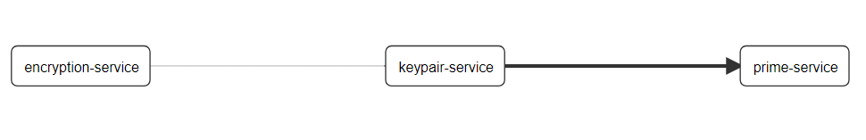

# RSA

This simple project demonstrates capabilities of Spring Boot and Spring Cloud frameworks to build distributed web application.

For the demo purposes it will implement RSA algorithm.

Micro services will be responsible for:
* finding pseudo-random prime numbers,
* generating public and private key,
* use them to encrypt and decrypt a message.

## Live demo
tbd

## Tech Stack

- Spring Boot
  - ~~Asynchronous Methods~~
- Spring Cloud
  - [Config Server](https://github.com/tomekceszke/rsa-config)
  - Netflix Eureka (service locator)
  - Feign + Ribbon (REST client with load balancing)
  - ~~Gateway~~
  - Hystrix (circuit breaker)
  - Sleuth + Zipkin (tracking)
- ~~Hibernate (persistence)~~
- JUnit, Spring MVC Test, WireMock
- Thymeleaf (presentation)
- ~~Docker~~
- Maven

## TODO
- Exception handlers
- Download KeyPairs in some common format
- CI/CD environment
- Production & live demo
- ...
  

